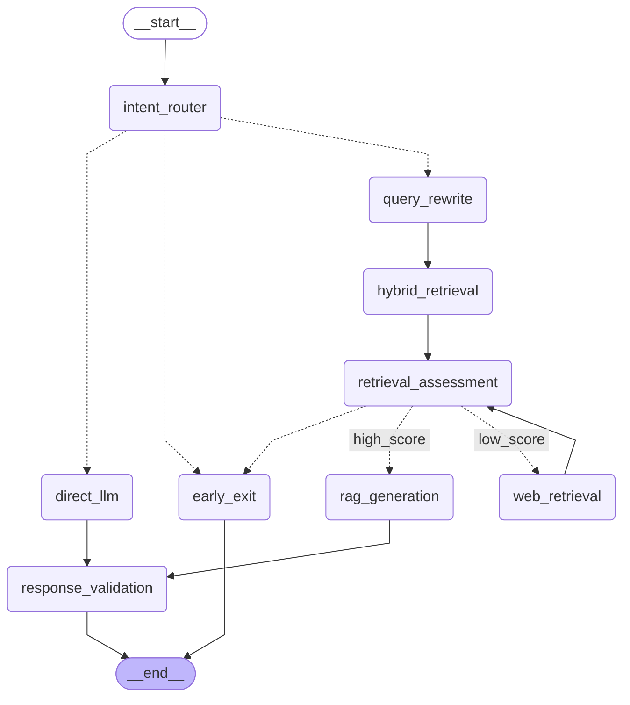

# 🏥 Hệ thống Trợ lý Y tế Thông minh (Intelligent Medical Assistant RAG)

[](https://www.python.org/)
[](https://fastapi.tiangolo.com/)
[](https://react.dev/)
[](https://langchain-ai.github.io/langgraph/)
[](https://onnxruntime.ai/)

Hệ thống Trợ lý Y tế Thông minh hỗ trợ tư vấn sức khỏe bằng tiếng Việt, được xây dựng trên kiến trúc **Full-stack React + FastAPI**, tích hợp mô hình định tuyến **PhoBERT ONNX**, viết lại câu hỏi bằng **ViT5-base**, và trả lời dựa trên kỹ thuật **Hybrid RAG** kết hợp suy luận từ **Local LLM (GGUF)**.

> [!IMPORTANT]
> **Tuyên bố Miễn trừ Trách nhiệm Y tế (Medical Disclaimer):**
> Đây là nguyên mẫu nghiên cứu & giáo dục hỗ trợ tư vấn y tế. Hệ thống **KHÔNG** thay thế chẩn đoán, đơn thuốc hay lời khuyên điều trị từ bác sĩ chuyên khoa. Đối với các triệu chứng cấp cứu hoặc chuyển biến nặng, người dùng phải lập tức liên hệ cơ sở y tế gần nhất hoặc gọi tổng đài cấp cứu (115).

---

## 🌟 Điểm nhấn & Định hướng Công nghệ (Current Direction)

Dự án được xây dựng và tối ưu hóa theo xu hướng hiện đại nhất của các hệ thống AI tác tử (Agentic AI) cục bộ:

1. **Định tuyến Siêu tốc với PhoBERT ONNX Classifier:**
   - Thay thế việc phân loại bằng LLM chậm chạp (Zero-shot) hoặc quy tắc cứng nhắc (Regex) bằng một mô hình **PhoBERT-base-v2** được fine-tune chuyên biệt và đóng gói dưới dạng **ONNX Runtime**.
   - Định tuyến câu hỏi chuẩn xác thành 4 nhóm chính: `medical` (y tế), `emergency` (cấp cứu), `out-of-scope` (ngoài luồng), và `faq` (hỏi đáp chatbot) chỉ với độ trễ cực thấp từ **10-30ms**.

2. **Viết lại câu hỏi thông minh với ViT5 Seq2Seq:**
   - Tích hợp mô hình **ViT5-base** chuyên viết lại câu hỏi tiếng Việt (`Query Rewrite`).
   - Tự động chuyển đổi các câu hỏi không dấu, viết sai chính tả, hoặc hành văn tự nhiên của người dùng (ví dụ: *"bo toi bi dau nguc du doi cuu voi"*) thành các truy vấn y khoa chuẩn hóa để cải thiện độ chính xác khi tìm kiếm RAG.
   - Có thể xuất sang **ONNX** (`optimum-cli`) để chạy mượt mà trên CPU.

3. **Điều phối Workflow linh hoạt bằng LangGraph:**
   - Hệ thống được cấu trúc dưới dạng Đồ thị trạng thái (`StateGraph`), bắt đầu từ `intent_router` đến `query_rewrite`, `hybrid_retrieval`, `retrieval_assessment` (thẩm định bằng chứng bằng `Evidence Grader`) và `rag_generation` (`answer_generation`).
   - Nếu phát hiện `emergency` hoặc `out-of-scope`, hệ thống lập tức đi tới node kết thúc sớm (`early_exit`) mà không chạy qua luồng RAG hay LLM sinh chữ, bảo đảm an toàn y tế và phản hồi tức thì.

4. **Tìm kiếm Lai (Hybrid Retrieval) & Thẩm định Bằng chứng:**
   - Kết hợp tìm kiếm ngữ nghĩa (**ChromaDB Vector Store**) và tìm kiếm từ khóa (**BM25**), sau đó dung hợp kết quả bằng thuật toán **RRF (Reciprocal Rank Fusion)**.
   - **Evidence Grader** tự động chấm điểm độ tin cậy của tài liệu. Nếu dữ liệu nội bộ không đủ thông tin, hệ thống sẽ kích hoạt **Web Crawler** để cào bổ sung từ các nguồn y khoa uy tín hàng đầu (`MedlinePlus`, `FDA`, `WHO`).

5. **Inference Cục bộ Hiệu năng cao với llama-server (GGUF):**
   - Không sử dụng API cloud đắt đỏ, backend tự động quản lý vòng đời của **`llama-server`** để chạy suy luận mô hình lượng hóa **Qwen GGUF** (ví dụ: `models/qwen3-4b-thinking.gguf`).
   - Khởi động và tắt tiến trình nền `llama-server` đồng bộ theo Server FastAPI qua cơ chế `lifespan`.

---

## 🏗️ Kiến trúc Hệ thống (System Architecture)

Sơ đồ mô tả luồng xử lý thực tế trong Đồ thị trạng thái LangGraph của hệ thống:



---

## 📂 Cấu trúc Thư mục Dự án

```text
.
├── backend/                       # Backend API Server & Xử lý RAG lõi
│   ├── api.py                     # Máy chủ FastAPI (REST API & SSE Streaming, quản lý llama-server)
│   ├── main.py                    # Giao diện CLI hỗ trợ kiểm thử & Ingest dữ liệu RAG
│   ├── config.py                  # Cấu hình tham số, trọng số và đường dẫn hệ thống
│   ├── requirements.txt           # Danh sách thư viện Python (fastapi, langgraph, onnxruntime...)
│   ├── graph.png                  # Sơ đồ kiến trúc luồng LangGraph
│   ├── .env.example               # Mẫu cấu hình biến môi trường (.env)
│   ├── llama-b9867-bin-win-.../   # Thư mục chứa tiến trình llama-server (mặc định cho Windows)
│   ├── data/                      # Dữ liệu y khoa & từ điển phân loại
│   │   ├── categories.json        # Định nghĩa 7 nhóm bệnh lý & rủi ro lâm sàng
│   │   ├── processed/             # Dữ liệu RAG đã qua làm sạch và phân mảnh (chunking)
│   │   └── ...
│   ├── evaluation/                # Bộ kiểm thử và đánh giá tự động
│   │   ├── eval_dataset.json      # Bộ dữ liệu đánh giá độ chính xác & an toàn (103 kịch bản)
│   │   ├── evaluate.py            # Script chạy đánh giá tự động (RAGAS / Custom metrics)
│   │   └── evaluation_results.json # Kết quả chuẩn đo lường (100% disclaimer, 0% violation)
│   ├── models/                    # Kho lưu trữ trọng số mô hình & Cơ sở dữ liệu Vector
│   │   ├── chromadb/              # Cơ sở dữ liệu Vector Store y khoa tiếng Việt (ChromaDB)
│   │   ├── bm25_index.pkl         # Chỉ mục từ khóa Lexical Search (Rank-BM25)
│   │   ├── qwen3-4b-thinking.gguf # Mô hình LLM suy luận cục bộ GGUF (4-bit quantized)
│   │   ├── phobert-intent-onnx/   # Mô hình định tuyến PhoBERT đóng gói ONNX
│   │   └── vit5-rewrite-onnx/     # Mô hình viết lại câu truy vấn ViT5 đóng gói ONNX
│   └── src/                       # Các module xử lý nghiệp vụ lõi
│       ├── langgraph_pipeline.py  # Đồ thị điều phối RAG (intent_router -> hybrid_retrieval -> ...)
│       ├── query_router.py        # Phân loại ý định & rủi ro sử dụng PhoBERT ONNX
│       ├── query_rewriter.py      # Viết lại & tối ưu câu hỏi bằng ViT5 ONNX
│       ├── hybrid_retriever.py    # Tìm kiếm lai (Vector + BM25 + RRF + Entity Reranking)
│       ├── evidence_grader.py     # Thẩm định độ tin cậy của evidence (Relevance & Sufficiency)
│       ├── web_crawler.py         # Cào dữ liệu bổ sung từ nguồn uy tín (Vinmec, Tâm Anh, Bộ Y tế...)
│       ├── qwen_llm.py            # Giao tiếp với Local LLM qua llama-server API
│       ├── llama_manager.py       # Quản lý vòng đời tiến trình nền llama-server
│       ├── response_generator.py  # Tổng hợp & soạn thảo câu trả lời (chuẩn Markdown, trích dẫn [N])
│       ├── response_validator.py  # Hậu kiểm an toàn (chặn từ khóa cấm, kiểm tra trích dẫn, disclaimer)
│       ├── safety_guard.py        # Bảo vệ an toàn, phát hiện cấp cứu 115 & câu hỏi ngoài luồng
│       ├── embeddings.py          # Quản lý mô hình embedding tiếng Việt (Dqdung205)
│       ├── vector_store.py        # Tương tác cơ sở dữ liệu Vector ChromaDB
│       ├── bm25_store.py          # Tương tác chỉ mục từ khóa BM25
│       ├── data_cleaner.py        # Làm sạch và chuẩn hóa văn bản y khoa
│       ├── ingest_db.py           # Script nạp dữ liệu vào Vector Store & BM25
│       ├── build_rag_kb.py        # Pipeline làm sạch, chunking và tạo knowledge base
│       └── utils.py               # Tiện ích bổ trợ (logging, formatting)
├── frontend/                      # Giao diện Web App (React 19 + Vite + Modern CSS)
│   ├── src/                       # Mã nguồn React UI (Chat SSE Stream, Emergency Toggle, Tooltips)
│   ├── package.json               # Cấu hình phụ thuộc NodeJS (react, vite, axios, lucide-react...)
│   └── vite.config.js             # Cấu hình Vite bundler
├── notebooks/                     # Nghiên cứu, thực nghiệm và fine-tuning AI
│   ├── 01-train-qwen3-medical-qa.ipynb # Huấn luyện LLM y khoa Qwen3-4B
│   ├── 03_clean_rag_chunks_vi.ipynb    # Làm sạch dữ liệu RAG tiếng Việt
│   ├── 04_train_phobert_intent.ipynb   # Huấn luyện mô hình phân loại Intent (PhoBERT)
│   ├── 05-train-vit5-rewrite.ipynb     # Huấn luyện mô hình viết lại câu hỏi (ViT5)
│   └── ddp-finetuning.ipynb            # Huấn luyện phân tán DDP trên nhiều GPU
├── generate_data.py               # Script tạo dữ liệu tổng hợp / giả lập
├── Report_NLP.pdf                 # Báo cáo tổng kết đồ án (PDF)
└── README.md                      # Tài liệu hướng dẫn hệ thống
```

---

## 🚀 Hướng dẫn Cài đặt & Khởi chạy

Hệ thống được phát triển và chạy mượt mà trên môi trường **Windows PowerShell** hoặc **Linux/macOS**.

### 1. Cấu hình Backend & Cài đặt Thư viện

Di chuyển vào thư mục dự án, tạo môi trường ảo và cài đặt các phụ thuộc cần thiết (đặc biệt là ONNX Runtime):

```powershell
# Di chuyển tới dự án
cd Intelligent-Medical-Assistant-for-Healthcare-Consultation

# Tạo và kích hoạt virtual environment
python -m venv .venv
.\.venv\Scripts\Activate.ps1

# Cài đặt thư viện
pip install --upgrade pip
pip install -r backend/requirements.txt
```

### 2. Chuẩn bị Trọng số Mô hình

Hệ thống yêu cầu các file mô hình được đặt chính xác trong thư mục `backend/models/`:

1. **LLM (GGUF):** Tải file mô hình lượng hóa `qwen3-4b-thinking.gguf` (hoặc tương đương) và lưu vào `backend/models/qwen3-4b-thinking.gguf`.
2. **PhoBERT ONNX:** Đảm bảo thư mục mô hình định tuyến ONNX đã được đặt tại `backend/models/phobert-intent-onnx/` (chứa `model.onnx`, `config.json`...).
3. **ViT5 ONNX (nếu có):** Đặt thư mục mô hình viết lại câu hỏi tại `backend/models/vit5-rewrite-onnx/`.

### 3. Nạp Cơ sở dữ liệu Tri thức (Vector DB Ingestion)

Tiến hành xử lý dữ liệu thô, sinh chỉ mục tìm kiếm lai (Vector + BM25):

```powershell
cd backend
python main.py --ingest
```

### 4. Khởi chạy Ứng dụng Full-stack

Mở hai terminal song song để chạy cả API backend và giao diện UI frontend.

#### 🌐 Terminal 1: Khởi chạy FastAPI Backend
```powershell
.\.venv\Scripts\Activate.ps1
cd backend
python api.py
```
*Lưu ý:* Khi khởi động, backend sẽ tự động gọi file thực thi `llama-server` chạy ngầm ở cổng 8080 để load mô hình GGUF. Đồng thời log `ONNX Model Loaded Successfully!` sẽ báo hiệu PhoBERT ONNX và ViT5 ONNX đã sẵn sàng. Bạn cũng có thể khởi chạy bằng lệnh `uv run api.py` nếu đang quản lý gói phụ thuộc bằng `uv`.

#### 🖥️ Terminal 2: Khởi chạy React Web App
```powershell
cd frontend
npm install
npm run dev
```
Truy cập trình duyệt theo địa chỉ: `http://localhost:5173`.

---

## 🛡️ Tiêu chuẩn Định dạng & An toàn Y khoa

- **Ngắt dòng tự nhiên:** Câu trả lời từ LLM được tinh chỉnh bằng các hướng dẫn hệ thống chi tiết giúp tối ưu khả năng hiển thị Markdown (sử dụng danh sách thụt dòng, chia đoạn bằng khoảng trắng và bôi đậm từ khóa y học quan trọng).
- **Phòng ngừa Khẩn cấp:** Mô hình định tuyến PhoBERT ONNX nhận diện các tình huống khẩn cấp chỉ trong vài mili-giây để đưa ra cảnh báo khẩn cấp hướng dẫn người dùng kết nối ngay với số điện thoại 115.
- **Ràng buộc Chứng cứ:** Nếu thông tin truy xuất RAG không đủ hoặc bị chấm điểm thấp bởi *Evidence Grader*, hệ thống sẽ trả về câu từ chối chuẩn mực nhằm tránh hiện tượng ảo giác (hallucination) gây nguy hiểm trong tư vấn y khoa.
- **Gắn Disclaimer:** Mọi câu trả lời liên quan tới bệnh lý đều tự động được đính kèm tuyên bố miễn trừ trách nhiệm pháp lý phù hợp với mức độ rủi ro đã phân loại.

---

## 💡 Hướng dẫn Xử lý Sự cố (Troubleshooting)

- **Lỗi `Failed to load ONNX model: ...`:** Kiểm tra xem bạn đã cài đặt `optimum[onnxruntime]` và `onnxruntime` chưa. Đồng thời kiểm tra xem thư mục `models/phobert-intent-onnx` có tồn tại ngay tại root của dự án không.
- **Lỗi liên quan tới `llama-server`:** Đảm bảo file thực thi `llama-server` (hoặc `llama-server.exe` trên Windows) nằm trong PATH hệ thống hoặc được đặt trong thư mục `backend/` để manager có thể tìm thấy và tự động khởi chạy. Bạn có thể kiểm tra log tiến trình này trong file `backend/llama_log.txt`.
